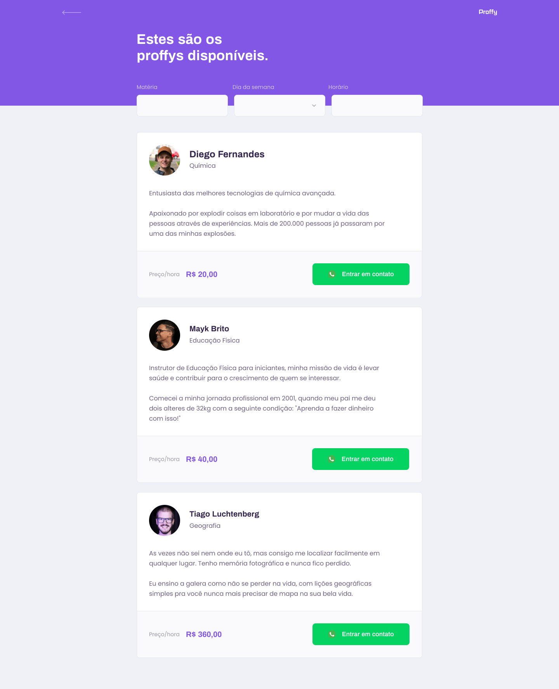

<h3 align="center">
  
  <b>💜 Proffy, Projeto da NLW2</b>
</h3>

<h3 align="end">
  
</h3>

## O que é?

> Proffy é uma plataforma de estudos online para, onde consegue conectar alunos e professores online

## WEB 🕸

<h3 align="center">
  
  
</h3>

## MOBILE 📲

<h3 align="center">
   
   
   
  
</h3>

## SERVER

### 🚧 `projeto ainda em construção`

### Projeto feito na semana [Next-Level-Week](https://rocketseat.com.br/) :rocket:
